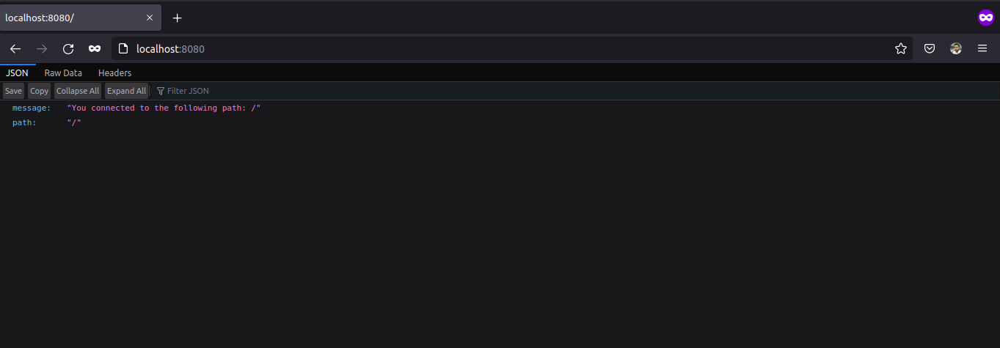

Then the following command is used to start a container of the image with the 8080 port opened:

```sh
ishraque@ishraque-laptop:~$ sudo docker run -it --rm -p 8080:8080 web-server
```

The following is shown in a web-browser when accessed through localhost:8080 :


The following output is shown in the terminal:

```sh
[GIN-debug] [WARNING] Creating an Engine instance with the Logger and Recovery middleware already attached.

[GIN-debug] [WARNING] Running in "debug" mode. Switch to "release" mode in production.
 - using env:   export GIN_MODE=release
 - using code:  gin.SetMode(gin.ReleaseMode)

[GIN-debug] GET    /*path                    --> server.Start.func1 (3 handlers)
[GIN-debug] Listening and serving HTTP on :8080
[GIN] 2022/02/24 - 22:00:01 | 200 |      47.568µs |      172.17.0.1 | GET      "/"
```