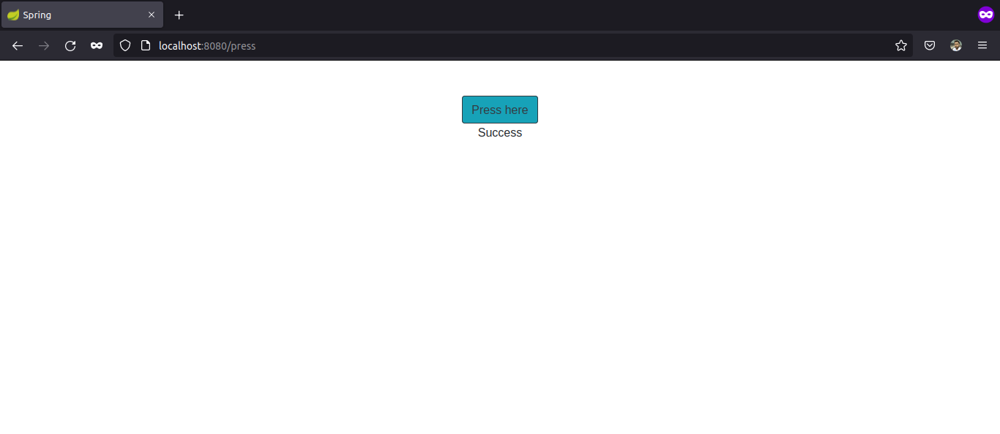

The github repository is cloned with:

```sh
ishraque@ishraque-laptop:~/PART-01/1.11$ sudo git clone https://github.com/docker-hy/material-applications
Cloning into 'material-applications'...
remote: Enumerating objects: 651, done.
remote: Counting objects: 100% (651/651), done.
remote: Compressing objects: 100% (402/402), done.
remote: Total 651 (delta 233), reused 586 (delta 170), pack-reused 0
Receiving objects: 100% (651/651), 715.70 KiB | 566.00 KiB/s, done.
Resolving deltas: 100% (233/233), done.
```

Only the required folder is kept by moving it out of the directories:
```sh
ishraque@ishraque-laptop:~/PART-01/1.11$ sudo mv ./material-applications/spring-example-project/ ../
ishraque@ishraque-laptop:~/PART-01/1.11$ sudo rm -rf material-applications/
```

After creating the Dockerfile, the image is built using:
```sh
ishraque@ishraque-laptop:~$ sudo docker build . -f ./PART-01/1.11/Dockerfile -t java-app:v1
```

The container is run using:
```sh
ishraque@ishraque-laptop:~$ sudo docker run --rm -it -p 8080:8080 java-app:v1 
```

The web application can be accessed through ```localhost:8080``` on a web browser


The output on the terminal is:

```sh

  .   ____          _            __ _ _
 /\\ / ___'_ __ _ _(_)_ __  __ _ \ \ \ \
( ( )\___ | '_ | '_| | '_ \/ _` | \ \ \ \
 \\/  ___)| |_)| | | | | || (_| |  ) ) ) )
  '  |____| .__|_| |_|_| |_\__, | / / / /
 =========|_|==============|___/=/_/_/_/
 :: Spring Boot ::        (v2.1.3.RELEASE)

2022-02-24 23:11:14.530  INFO 1 --- [           main] c.d.dockerexample.DemoApplication        : Starting DemoApplication v1.1.3 on 9fda11a5e930 with PID 1 (/usr/src/app/target/docker-example-1.1.3.jar started by root in /usr/src/app)
2022-02-24 23:11:14.532  INFO 1 --- [           main] c.d.dockerexample.DemoApplication        : No active profile set, falling back to default profiles: default
2022-02-24 23:11:15.388  INFO 1 --- [           main] o.s.b.w.embedded.tomcat.TomcatWebServer  : Tomcat initialized with port(s): 8080 (http)
2022-02-24 23:11:15.410  INFO 1 --- [           main] o.apache.catalina.core.StandardService   : Starting service [Tomcat]
2022-02-24 23:11:15.410  INFO 1 --- [           main] org.apache.catalina.core.StandardEngine  : Starting Servlet engine: [Apache Tomcat/9.0.16]
2022-02-24 23:11:15.421  INFO 1 --- [           main] o.a.catalina.core.AprLifecycleListener   : The APR based Apache Tomcat Native library which allows optimal performance in production environments was not found on the java.library.path: [/usr/java/packages/lib/amd64:/usr/lib64:/lib64:/lib:/usr/lib]
2022-02-24 23:11:15.474  INFO 1 --- [           main] o.a.c.c.C.[Tomcat].[localhost].[/]       : Initializing Spring embedded WebApplicationContext
2022-02-24 23:11:15.474  INFO 1 --- [           main] o.s.web.context.ContextLoader            : Root WebApplicationContext: initialization completed in 903 ms
2022-02-24 23:11:15.635  INFO 1 --- [           main] o.s.s.concurrent.ThreadPoolTaskExecutor  : Initializing ExecutorService 'applicationTaskExecutor'
2022-02-24 23:11:15.736  INFO 1 --- [           main] o.s.b.a.w.s.WelcomePageHandlerMapping    : Adding welcome page template: index
2022-02-24 23:11:15.866  INFO 1 --- [           main] o.s.b.w.embedded.tomcat.TomcatWebServer  : Tomcat started on port(s): 8080 (http) with context path ''
2022-02-24 23:11:15.868  INFO 1 --- [           main] c.d.dockerexample.DemoApplication        : Started DemoApplication in 1.62 seconds (JVM running for 1.877)
2022-02-24 23:12:47.508  INFO 1 --- [nio-8080-exec-1] o.a.c.c.C.[Tomcat].[localhost].[/]       : Initializing Spring DispatcherServlet 'dispatcherServlet'
2022-02-24 23:12:47.508  INFO 1 --- [nio-8080-exec-1] o.s.web.servlet.DispatcherServlet        : Initializing Servlet 'dispatcherServlet'
2022-02-24 23:12:47.512  INFO 1 --- [nio-8080-exec-1] o.s.web.servlet.DispatcherServlet        : Completed initialization in 4 ms
```