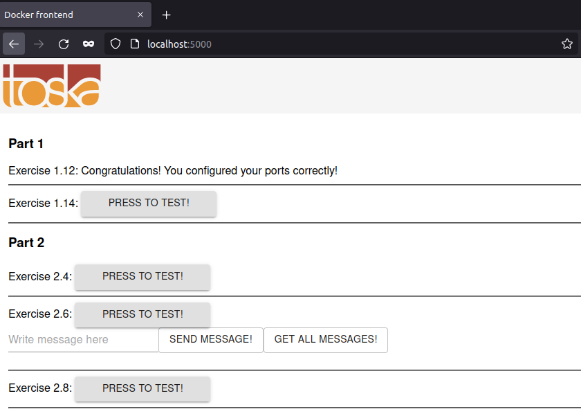

The git repo has been downloaded into local machine.
Then the subdirectory (example-frontend) with the required files are manually copied to this exercise directory.

The docker image is built with the following:
```sh
ishraque@ishraque-laptop:~/PART-01/1.12$ sudo docker build . -t frontend
```

Then the container is launched with:
```sh
ishraque@ishraque-laptop:~/PART-01/1.12$ sudo docker run -it --rm -p 5000:5000 frontend
```

The web application can be accessed through ```localhost:5000``` on a web browser


The output on the terminal is:

```sh
   ┌────────────────────────────────────────────────┐
   │                                                │
   │   Serving!                                     │
   │                                                │
   │   - Local:            http://localhost:5000    │
   │   - On Your Network:  http://172.17.0.2:5000   │
   │                                                │
   └────────────────────────────────────────────────┘

```
