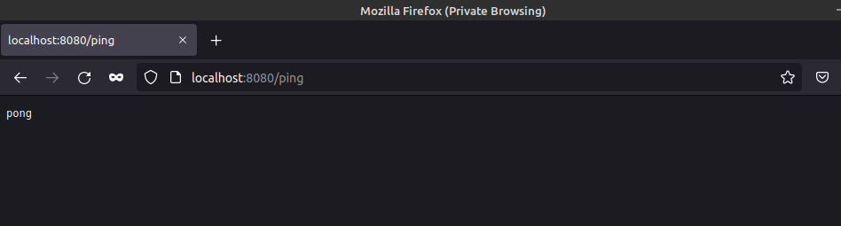

The git repo has been downloaded into local machine.
Then the subdirectory (example-backend) with the required files are manually copied to this exercise directory.

The docker image is built with the following:
```sh
ishraque@ishraque-laptop:~$ sudo docker build . -f ./PART-01/1.12/Dockerfile -t backend
```

Then the container is launched with:
```sh
ishraque@ishraque-laptop:~$ sudo docker run -it --rm -p 8080:8080 backend
```

The web application can be accessed through ```localhost:5000``` on a web browser


It can also be access with curl:
```sh
ishraque@ishraque-laptop:~$ curl localhost:8080/ping
pong
```

The output on the terminal is:
```sh
[Ex 2.4+] REDIS_HOST env was not passed so redis connection is not initialized
[Ex 2.6+] POSTGRES_HOST env was not passed so postgres connection is not initialized
[GIN-debug] [WARNING] Creating an Engine instance with the Logger and Recovery middleware already attached.

[GIN-debug] [WARNING] Running in "debug" mode. Switch to "release" mode in production.
 - using env:   export GIN_MODE=release
 - using code:  gin.SetMode(gin.ReleaseMode)

[GIN-debug] GET    /ping                     --> server/router.pingpong (4 handlers)
[GIN-debug] GET    /messages                 --> server/controller.GetMessages (4 handlers)
[GIN-debug] POST   /messages                 --> server/controller.CreateMessage (4 handlers)
[GIN-debug] Listening and serving HTTP on :8080
[GIN] 2022/03/03 - 05:13:33 | 200 |    1.507162ms |      172.17.0.1 | GET      "/ping"
```