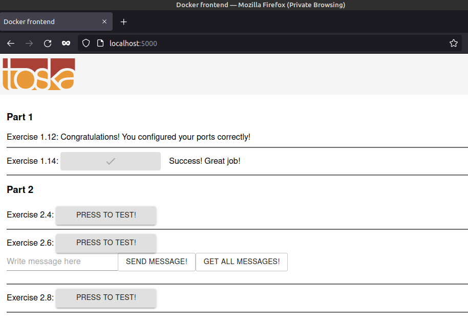

The git repo has been downloaded into local machine.
Then the subdirectories (example-backend and example-frontend) with the required files are manually copied to this exercise directory.

The frontend docker image is built and run with the following:
```sh
ishraque@ishraque-laptop:~$ sudo docker build . -f ./PART-01/1.14/Dockerfile-frontend -t frontend; sudo docker run -it --rm -p 5000:5000 frontend
```

The backend docker image is built and run with the following:
```sh
ishraque@ishraque-laptop:~$ sudo docker build . -f ./PART-01/1.14/Dockerfile-backend -t backend; sudo docker run -it --rm -p 8080:8080 backend
```

The web application can be accessed through ```localhost:5000``` on a web browser
