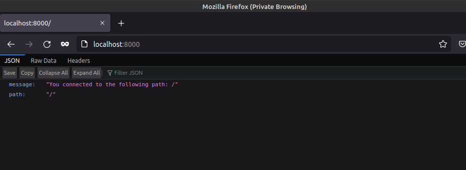

The docker-compose file is brought up with:
```sh
ishraque@ishraque-laptop:~$ sudo docker-compose -f PART-02/2.2/docker-compose.yml up -d
```

The web service can be browsed through the browser


This can also be accessed from the terminal using:
```sh
ishraque@ishraque-laptop:~/Desktop/Project/devops-with-docker$ curl localhost:8000
{"message":"You connected to the following path: /","path":"/"}
```


The docker-compose file is brought down with:
```sh
ishraque@ishraque-laptop:~$ sudo docker-compose -f PART-02/2.2/docker-compose.yml down -v
```