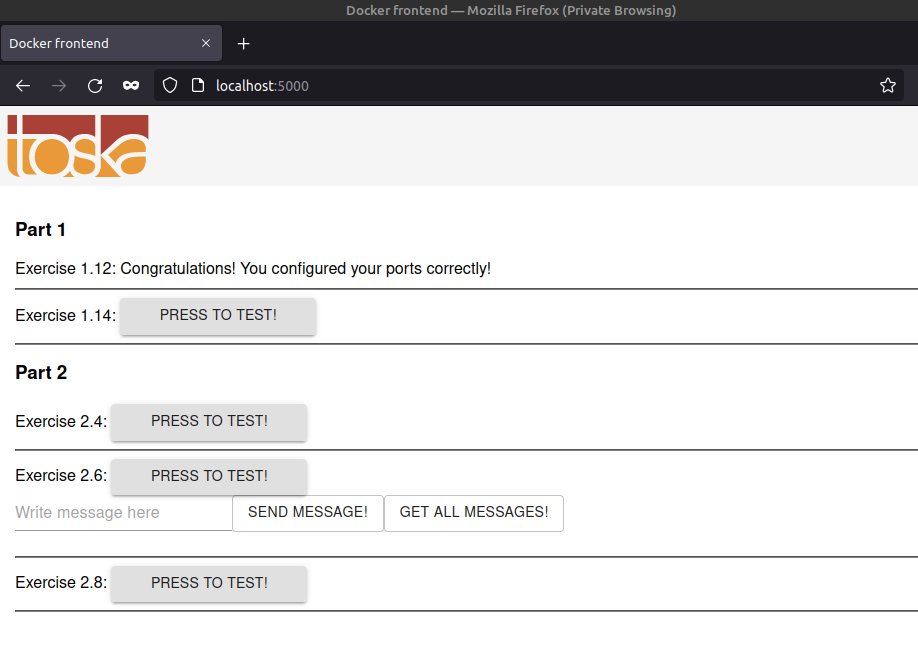

The files and relevent directories from PART-01/1.14 are copied into PART-02/2.3 for ease of use.

The docker-compose file can be brought up with:
```sh
ishraque@ishraque-laptop:~$ sudo docker-compose -f ./PART-02/2.3/docker-compose.yml up -d
```

The webserver can be accessed from the browser



The docker-compose file can be brought down with:
```sh
ishraque@ishraque-laptop:~$ sudo docker-compose -f ./PART-02/2.3/docker-compose.yml down -v
```