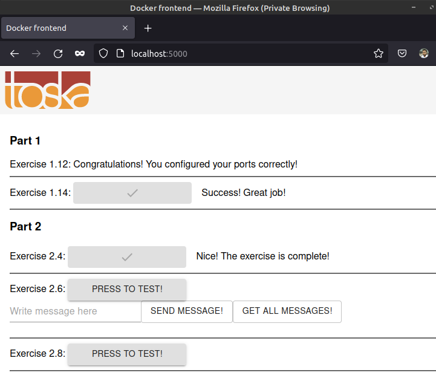

The files and relevent directories from PART-01/1.14 are copied into PART-02/2.4 for ease of use.

The ```Dockerfile-backend```, ```Dockerfle-frontend``` and ```docker-compose.yml``` from PART-02/2.3 are copied into PART-02/2.4 for ease of use.

The docker-compose.yml is modified according to the instructions for this exercise.

A redis container is added and the backend container is connected to the redis container using an environment variable: ```REDIS_HOST=redis```

---

The docker-compose file can be brought up with:
```sh
ishraque@ishraque-laptop:~$ sudo docker-compose -f ./PART-02/2.4/docker-compose.yml up -d
```

The webserver can be accessed from the browser



The docker-compose file can be brought down with:
```sh
ishraque@ishraque-laptop:~$ sudo docker-compose -f ./PART-02/2.4/docker-compose.yml down -v
```