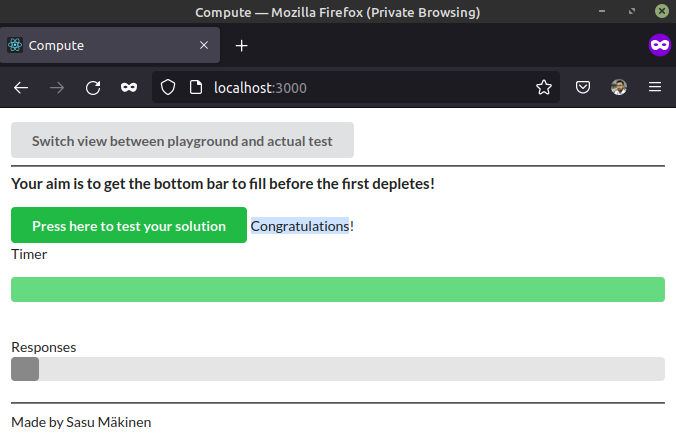

The required directory ```scaling-exercise``` is copied from the Github repository into PART02/2.5.

The following command is used to run the containers and scale the compute module 10 times:

```sh
ishraque@ishraque-laptop:~$ docker-compose -f ./PART-02/2.5/scaling-exercise/docker-compose.yml up --scale compute=10 -d
Creating network "scaling-exercise_default" with the default driver
Creating load-balancer               ... done
Creating calculator                  ... done
Creating scaling-exercise_compute_1  ... done
Creating scaling-exercise_compute_2  ... done
Creating scaling-exercise_compute_3  ... done
Creating scaling-exercise_compute_4  ... done
Creating scaling-exercise_compute_5  ... done
Creating scaling-exercise_compute_6  ... done
Creating scaling-exercise_compute_7  ... done
Creating scaling-exercise_compute_8  ... done
Creating scaling-exercise_compute_9  ... done
Creating scaling-exercise_compute_10 ... done
```

The webserver can be accessed from the browser



The docker-compose file can be brought down with:
```sh
ishraque@ishraque-laptop:~$ docker-compose -f ./PART-02/2.5/scaling-exercise/docker-compose.yml down -v
Stopping scaling-exercise_compute_6  ... done
Stopping scaling-exercise_compute_2  ... done
Stopping scaling-exercise_compute_8  ... done
Stopping scaling-exercise_compute_3  ... done
Stopping scaling-exercise_compute_7  ... done
Stopping scaling-exercise_compute_9  ... done
Stopping scaling-exercise_compute_1  ... done
Stopping scaling-exercise_compute_4  ... done
Stopping scaling-exercise_compute_5  ... done
Stopping scaling-exercise_compute_10 ... done
Stopping calculator                  ... done
Stopping load-balancer               ... done
Removing scaling-exercise_compute_6  ... done
Removing scaling-exercise_compute_2  ... done
Removing scaling-exercise_compute_8  ... done
Removing scaling-exercise_compute_3  ... done
Removing scaling-exercise_compute_7  ... done
Removing scaling-exercise_compute_9  ... done
Removing scaling-exercise_compute_1  ... done
Removing scaling-exercise_compute_4  ... done
Removing scaling-exercise_compute_5  ... done
Removing scaling-exercise_compute_10 ... done
Removing calculator                  ... done
Removing load-balancer               ... done
Removing network scaling-exercise_default
```