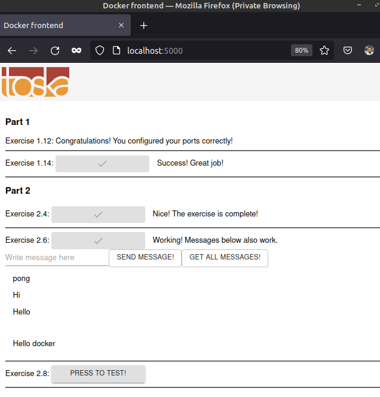

The required directories ```example-frontend``` and ```example-backend``` are copied from the Github repository into PART02/2.6.

The required changes are made to the ```docker-compose.yml``` file:
1. added a postgres server
2. connected the postgres server to the backend with the necessary credentials


The following command is used to run the containers:

```sh
ishraque@ishraque-laptop:~$ docker-compose -f ./PART-02/2.5/docker-compose.yml up -d
```

The webserver can be accessed from the browser




The following command is used to turn down the containers:

```sh
ishraque@ishraque-laptop:~$ docker-compose -f ./PART-02/2.5/docker-compose.yml down -v
```