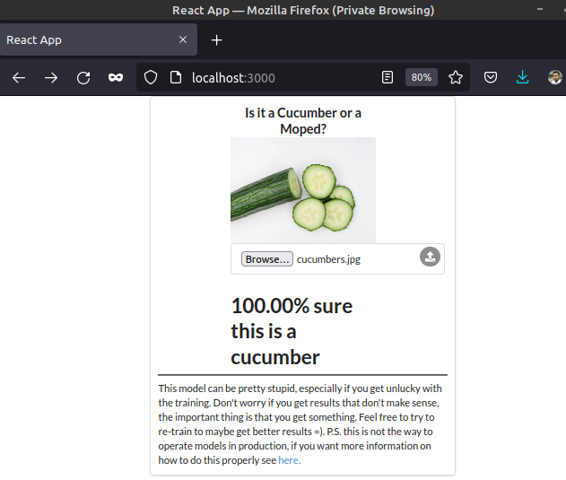

The related git repositories are cloned into PART-02/2.7.

The ```docker-compose.yml``` file is made according to the needs of this exercise.

The following command is used to run the containers:

```sh
ishraque@ishraque-laptop:~$ docker-compose -f ./PART-02/2.7/docker-compose.yml up -d
```

The webserver can be accessed from the browser




The following command is used to turn down the containers:

```sh
ishraque@ishraque-laptop:~$ docker-compose -f ./PART-02/2.7/docker-compose.yml down -v
```